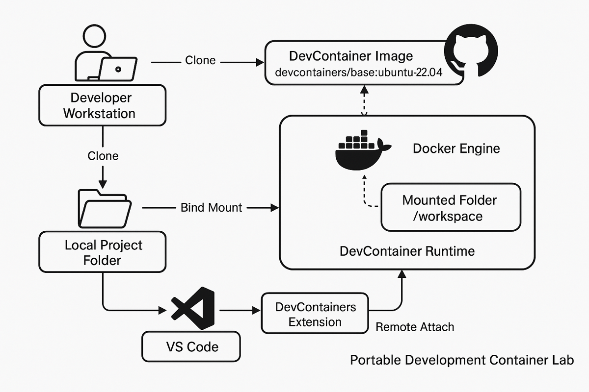

# Portable DevContainer Lab – Architecture & Documentation

A platform-agnostic, reproducible DevContainer environment designed for stability, portability, and developer experience.

This repo serves as a documentation hub for the project — **architecture diagram + build rationale** — with the implementation stored in a private repository.

---

## ✨ Why this project exists

I set out to build a reliable, reproducible DevContainer lab to support my DevOps, DevSecOps, and Platform Engineering learning journey.

Along the way, I encountered:

- 🟠 ARM architecture mirror failures
- 🟠 Inconsistent `apt-get` package installs
- 🟠 Cross-platform (x86 vs ARM) Docker build issues
- 🟠 VS Code DevContainer attachment quirks

Instead of patching individual failures, I paused and asked:

> 🧠 How do I design a stable platform?
> 🧠 How do I ensure this works across multiple developer machines?
> 🧠 How do I build once, and reuse everywhere?

This mindset shift led to:

✅ Swapping to a Microsoft DevContainer base image for ARM stability  
✅ Stripping fragile dependencies from Dockerfile  
✅ Validating reproducibility across 2 laptop's (both M1 ARM)  
✅ Version-controlling a clean baseline in a private repo  
✅ Creating this architecture documentation for future maintainers

---

## 🗺️ Architecture Diagram

**Key flow:**

1. Clone repo → local project folder
2. Bind mount → `/workspace` inside DevContainer runtime
3. Docker Engine runs DevContainer image
4. VS Code → DevContainers extension → remote attach → running container

---

## 🛠️ Technologies

- VS Code + DevContainers Extension
- Docker Engine
- DevContainer Image: `mcr.microsoft.com/devcontainers/base:ubuntu-22.04`
- Portable developer workstation
- GitHub (private implementation repo)

---

## 🔒 Codebase

The implementation (Dockerfile, `.devcontainer` configs, etc.) is stored in a **private repo**.

This repo intentionally contains **only documentation and architecture artifacts**.

---

## 📢 Credits

Thanks to the open source DevContainers, Docker, and VS Code communities for enabling portable developer environments.

---
